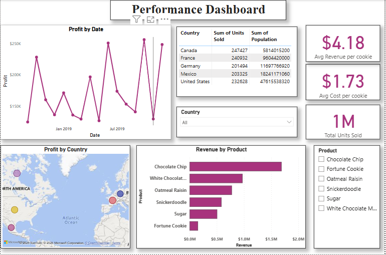

# 🍪 Cookie Sales Performance Dashboard with Population Analysis

## 📊 Overview

This project combines cookie sales data with real-time web data on country populations to uncover sales performance, product trends, and market opportunities. Built using **Power BI**, the dashboard demonstrates how internal transactional data can be enriched with external public data for deeper business insights.

---

## 📂 Data Sources

1. **Cookie Sales Dataset**  
   File: `Cookie Types.xlsx`  
   - Fields: Product Type, Units Sold, Date, Country, Cost, Revenue  
   - Purpose: Analyze cookie sales across countries and products.

2. **Population Data (Web)**  
   Source: [Wikipedia – List of countries and dependencies by population](https://en.wikipedia.org/wiki/List_of_countries_and_dependencies_by_population)  
   - Extracted using Power BI Web Connector  
   - Fields: Country, Population  
   - Purpose: Understand market size and contextualize sales volume.

---

## 🛠 Tools Used

- **Power BI Desktop** – Data modeling, DAX, and visualization  
- **Power Query** – Data extraction and transformation  
- **DAX** – Calculated columns, KPIs, and measures  
- **GitHub** – Project documentation and version control

---

## 🎯 Objectives

- Identify top-selling cookie products by revenue and unit sales  
- Analyze profit trends over time  
- Compare sales across countries with their population  
- Calculate cost vs. revenue per cookie  
- Discover high-potential markets based on sales-to-population ratio

---

## 🧹 Data Preparation

### Cookie Data
- Cleaned and verified for missing or inconsistent entries
- Standardized column names (e.g., "Product", "Units Sold", "Country", etc.)
- Converted date column to proper datetime format for time series analysis

### Web Population Data
- Imported using Power BI's **Web** data connector
- Cleaned to retain only the required columns (Country & Population)
- Merged with cookie data using the country as the key

---

## 📈 Dashboard Features

### Key Metrics:
- **Total Units Sold:** 1 Million+  
- **Average Cost per Cookie:** $1.73  
- **Average Revenue per Cookie:** $4.18  

### Visuals:
- **Line Chart:** Profit over time (monthly trend)
- **Bar Chart:** Revenue by Product
- **Map Visual:** Country-wise units sold with population overlay
- **Table:** Units sold and population by country

### Filters Used:
- **Country**
- **Product Type**

---

## 🔍 Detailed Key Insights

### 1. 🏆 Top Performing Cookie Products
- Chocolate Chip dominates in revenue.
- White Chocolate Macadamia, Oatmeal Raisin, and Snickerdoodle follow.
- Sugar and Fortune Cookies perform less well.  
> **Insight:** Classic flavors like Chocolate Chip are strong performers across markets. Diversifying with top flavors in underperforming regions could boost sales.

### 2. 🌍 Country-Wise Sales vs Population Impact
| Country       | Units Sold | Population (at time of capture)   |
|---------------|------------|-----------------------------------|
| Canada        | 247,427    | 5.8 Billion                       |
| France        | 240,932    | 9.6 Billion                       |
| Germany       | 201,494    | 11.6 Billion                      |
| Mexico        | 203,325    | 18.2 Billion                      |
| United States | 232,628    | 47.6 Billion                      |

> Population values were extracted directly from the Wikipedia source using Power BI's Web connector and represent the state of data at the time of capture.

- Despite higher populations, countries like Mexico and Germany have lower unit sales compared to Canada and the U.S.
- Canada shows the highest units sold, even though its population is lower than the U.S. and Mexico.  
> **Insight:** There’s a potential market opportunity in countries where the population is high, but sales figures lag. High population does not guarantee higher sales—brand reach, cultural preferences, and availability could be influencing factors.

### 3. 📅 Profit Over Time
- Steady growth trend observed, peaking around July 2019.  
> **Insight:** Indicates possible seasonal demand spikes mid-year. Planning promotional campaigns around this period could amplify profits.

### 4. 💰 Per Cookie Financial Metrics
- Avg. Cost: $1.73 | Avg. Revenue: $4.18 | Margin: >2.4x  
> **Insight:** Strong profitability per cookie, suggesting efficient cost management and high product value.

### 5. 🧭 Interactive Filtering
- Filters by Country and Product Type allow targeted analysis.  
> **Insight:** Enables data storytelling and scenario analysis—ideal for use by sales teams and product strategists.

---

## 🖼️ Dashboard Snapshot

---

## 📌 Conclusion

This Power BI dashboard showcases how internal product data can be enhanced by web-sourced public data to identify performance trends and growth opportunities. The use of real-time population data offers a market-aware perspective for sales analysis.
